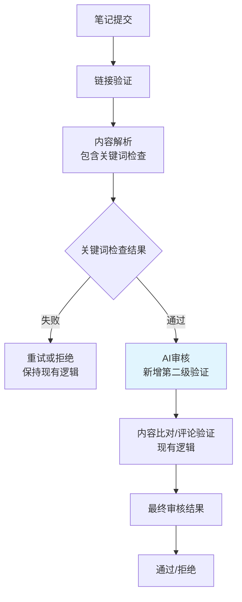

# AI内容分析审核架构设计文档

## 文档信息
- **创建时间**: 2026-01-02
- **版本**: v1.0
- **作者**: Kilo Code
- **状态**: 设计阶段

## 背景与问题分析

### 当前关键词匹配的痛点
1. **误报**: 文章提到了"减肥"，但其实是正常的减肥心得，不是维权
2. **漏报**: 用户没写"被骗"，写的是"姐妹们快跑"、"气得我手抖"等口语化表达
3. **维护成本**: 需要不断更新关键词库，难以覆盖所有变体

### 业务需求
- 准确识别"女性被骗维权/避雷"内容
- 区分真实维权分享 vs 恶意抹黑
- 降低人工审核成本
- 提高审核效率和准确性

## 解决方案设计

### 总体架构

**核心理念：插入现有审核流程，不修改关键词检查逻辑**



### AI模型选择策略

#### 双模型架构
- **主模型**: DeepSeek V3/R1
  - 优势: 理解中文社交媒体语境，成本低($0.001/1K tokens)
  - 适用: 快速识别常规维权内容
- **备选模型**: Claude 3.5 Sonnet
  - 优势: 逻辑推理严密，适合复杂判断
  - 适用: 处理边界案例和争议内容

#### 切换逻辑
```javascript
const AI_MODEL_SELECTION = {
  primary: 'deepseek-v3',
  fallback: 'claude-3.5-sonnet',
  switchThreshold: 0.7, // AI置信度低于此值时切换备选模型
  maxRetries: 2
};
```

### 触发机制设计

#### 插入现有审核流程的策略

**不修改现有关键词检查逻辑**，在关键词检查通过后插入AI审核：

```javascript
// 现有代码位置：asyncAiReviewService.js 第310-314行 (笔记审核)
if (contentResult.keywordCheck && contentResult.keywordCheck.passed) {
  console.log(`✅ 关键词检查通过 (attempt=${reviewAttempt}):`, contentResult.keywordCheck.message);
  console.log(`🔄 关键词检查通过，开始检查下一项：内容匹配`);

  // 【新增】插入AI审核逻辑
  const aiAnalysis = await aiContentAnalysisService.analyzeVictimPost(
    contentResult, // 传递完整内容结果
    contentResult.keywordCheck.category
  );

  // AI审核结果影响最终决定
  if (!aiAnalysis.is_genuine_victim_post) {
    console.log(`❌ AI审核失败: ${aiAnalysis.reason}`);
    aiReviewResult.aiReview.passed = false;
    aiReviewResult.aiReview.confidence = 0.1;
    aiReviewResult.aiReview.reasons.push(`AI分析：${aiAnalysis.reason}`);
    // 直接返回，不继续后续审核
    return aiReviewResult;
  } else {
    console.log(`✅ AI审核通过: ${aiAnalysis.reason}`);
    aiReviewResult.aiReview.confidence += 0.2;
    aiReviewResult.aiReview.reasons.push(`AI确认维权内容真实性`);
  }

  // 记录AI分析结果
  aiReviewResult.aiAnalysis = aiAnalysis;

  // 继续现有内容比对逻辑...
}
```

#### AI审核触发条件
- **前提**: 关键词检查必须通过（保持现有逻辑）
- **触发**: 对所有关键词检查通过的内容进行AI审核
- **目的**: 在内容比对前进行第二层真实性验证

### AI审核Prompt设计

#### 核心Prompt模板
```javascript
const VICTIM_POST_ANALYSIS_PROMPT = `
你是一名专业的内容审核专家，专门识别小红书上的女性维权/避雷贴。

任务：分析以下抓取到的笔记内容，判断其是否属于真实的"被骗维权/避雷分享"。

判定维度：
1. 核心事件：文章是否描述了在 [${scamCategory}] 过程中遭受金钱损失或货不对板？
2. 维权特征：是否包含"避雷"、"维权"、"举报"、"投诉"、"退款"等语义？
3. 真实性：文字是否看起来像真人的情感宣泄，而不是机器生成的垃圾广告？
4. 情感特征：是否包含愤怒、失望、无奈等真实情绪表达？

笔记内容：
${noteContent}

输出格式 (JSON)：
{
  "is_genuine_victim_post": boolean,
  "scam_category": "减肥/护肤/医美/手镯定制/...",
  "confidence_score": 0.0-1.0,
  "emotion_analysis": {
    "anger_level": 0-10,
    "disappointment_level": 0-10,
    "urgency_level": 0-10
  },
  "reason": "详细分析理由",
  "risk_factors": ["可能的风险点"],
  "recommendation": "审核建议"
}
`;
```

#### 诈骗类型识别
```javascript
const SCAM_CATEGORIES = [
  '减肥诈骗', '护肤诈骗', '祛斑诈骗', '丰胸诈骗',
  '医美诈骗', '白发转黑诈骗', '手镯定制诈骗'
];
```

### 技术实现方案

#### 1. AI服务框架 (`aiContentAnalysisService.js`)
```javascript
class AiContentAnalysisService {
  constructor() {
    this.deepseekClient = new DeepSeekClient(process.env.DEEPSEEK_API_KEY);
    this.claudeClient = new ClaudeClient(process.env.CLAUDE_API_KEY);
    this.cache = new NodeCache({ stdTTL: 3600 }); // 1小时缓存
  }

  async analyzeVictimPost(content, scamCategory) {
    // 缓存检查
    const cacheKey = this.generateCacheKey(content, scamCategory);
    const cached = this.cache.get(cacheKey);
    if (cached) return cached;

    // 主模型调用
    let result = await this.callDeepSeek(content, scamCategory);

    // 备选模型切换逻辑
    if (result.confidence_score < AI_MODEL_SELECTION.switchThreshold) {
      console.log('主模型置信度不足，切换到备选模型');
      result = await this.callClaude(content, scamCategory);
    }

    // 缓存结果
    this.cache.set(cacheKey, result);
    return result;
  }
}
```

#### 2. 缓存机制
- **缓存键**: 内容MD5 + 诈骗类型
- **过期时间**: 1小时
- **命中率目标**: >80%

#### 3. 错误处理与重试
```javascript
const ERROR_HANDLING = {
  maxRetries: 3,
  retryDelay: [1000, 2000, 5000], // 指数退避
  fallbackStrategy: 'claude_fallback',
  circuitBreaker: {
    failureThreshold: 5,
    resetTimeout: 300000 // 5分钟
  }
};
```

### 集成到现有审核流程

#### 插入点分析

基于现有代码分析，AI审核插入点如下：

1. **笔记审核插入点**: `asyncAiReviewService.js:310-314`
   ```javascript
   // 现有代码位置
   console.log(`✅ 关键词检查通过 (attempt=${reviewAttempt}):`, contentResult.keywordCheck.message);
   console.log(`🔄 关键词检查通过，开始检查下一项：内容匹配`);

   // 【在此处插入AI审核】
   ```

2. **评论审核插入点**: `asyncAiReviewService.js:446-450`
   ```javascript
   // 现有代码位置
   console.log(`✅ 评论审核关键词检查通过 (attempt=${reviewAttempt}):`, contentResult.keywordCheck.message);
   console.log(`🔄 评论审核关键词检查通过，开始检查下一项：评论验证`);

   // 【在此处插入AI审核】
   ```

#### 具体实现代码

**笔记审核AI插入**：
```javascript
// 在关键词检查通过后，内容比对前插入
if (contentResult.keywordCheck && contentResult.keywordCheck.passed) {
  console.log(`✅ 关键词检查通过，准备AI审核`);

  // 插入AI审核逻辑
  const aiAnalysis = await aiContentAnalysisService.analyzeVictimPost(
    $('body').text().substring(0, 2000), // 传递页面内容
    contentResult.keywordCheck.category
  );

  // AI审核失败：直接拒绝，不继续后续审核
  if (!aiAnalysis.is_genuine_victim_post) {
    console.log(`❌ AI审核失败: ${aiAnalysis.reason}`);
    aiReviewResult.aiReview.passed = false;
    aiReviewResult.aiReview.confidence = 0.1;
    aiReviewResult.aiReview.reasons.push(`AI分析：${aiAnalysis.reason}`);
    aiReviewResult.aiAnalysis = aiAnalysis;
    return aiReviewResult; // 提前返回，不继续内容比对
  }

  // AI审核通过：继续现有逻辑
  console.log(`✅ AI审核通过: ${aiAnalysis.reason}`);
  aiReviewResult.aiReview.confidence += 0.2;
  aiReviewResult.aiReview.reasons.push(`AI确认维权内容真实性`);
  aiReviewResult.aiAnalysis = aiAnalysis;

  // 继续现有内容比对逻辑...
}
```

**评论审核AI插入**：
```javascript
// 在关键词检查通过后，评论验证前插入
if (contentResult.keywordCheck && contentResult.keywordCheck.passed) {
  console.log(`✅ 评论审核关键词检查通过，准备AI审核`);

  // 插入AI审核逻辑（同上）
  const aiAnalysis = await aiContentAnalysisService.analyzeVictimPost(
    $('body').text().substring(0, 2000),
    contentResult.keywordCheck.category
  );

  // AI审核失败处理（同上）
  if (!aiAnalysis.is_genuine_victim_post) {
    aiReviewResult.aiReview.passed = false;
    aiReviewResult.aiReview.confidence = 0.1;
    aiReviewResult.aiReview.reasons.push(`AI分析：${aiAnalysis.reason}`);
    aiReviewResult.aiAnalysis = aiAnalysis;
    return aiReviewResult;
  }

  // 继续现有评论验证逻辑...
}
```

#### 修改点2: 审核统计更新
添加AI审核相关的统计指标：
- AI调用次数
- AI审核准确率
- 缓存命中率
- 模型切换频率

### 性能优化

#### 1. 成本控制
- **触发阈值**: 只对中高权重内容调用AI
- **缓存机制**: 避免重复分析相同内容
- **批量处理**: 支持批量AI审核请求

#### 2. 响应时间优化
- **并发限制**: 最多5个并发AI请求
- **超时控制**: 单次AI调用最长30秒
- **异步处理**: AI审核不阻塞主审核流程

### 监控与运维

#### 关键指标
```javascript
const MONITORING_METRICS = {
  ai_call_count: 0,
  ai_success_rate: 0,
  ai_average_response_time: 0,
  cache_hit_rate: 0,
  model_switch_count: 0,
  false_positive_rate: 0,
  false_negative_rate: 0
};
```

#### 日志记录
- AI审核详细日志
- 错误和异常记录
- 性能监控日志

### 风险评估

#### 技术风险
1. **API稳定性**: 双模型备选方案降低单点故障风险
2. **成本超支**: 触发阈值和缓存机制控制成本
3. **性能影响**: 异步处理和并发限制保证系统稳定性

#### 业务风险
1. **审核准确性**: A/B测试验证AI审核效果
2. **用户体验**: 确保审核速度不明显下降
3. **合规风险**: 审核逻辑透明，可解释

### 实施计划

#### 第一阶段：基础设施搭建 (1-2周)
- [ ] 申请并配置DeepSeek API
- [ ] 创建AI服务框架
- [ ] 实现基础缓存机制
- [ ] 编写测试用例

#### 第二阶段：核心功能开发 (2-3周)
- [ ] 实现Prompt模板
- [ ] 集成到审核流程
- [ ] 添加错误处理
- [ ] 性能优化

#### 第三阶段：测试与调优 (1-2周)
- [ ] 准确性测试 (误报/漏报率)
- [ ] 性能测试 (响应时间、并发)
- [ ] 成本监控
- [ ] 生产环境部署

#### 第四阶段：监控与迭代 (持续)
- [ ] 建立监控指标
- [ ] 定期效果评估
- [ ] Prompt持续优化
- [ ] 新诈骗类型支持

### 预期收益

#### 量化指标
- **审核准确率**: 提升30-50%
- **人工审核量**: 减少60-80%
- **审核速度**: 维持现有水平
- **运营成本**: AI调用成本 < 人工成本

#### 质量提升
- 降低误报率
- 提高漏报识别率
- 增强对新型诈骗的适应性
- 提升用户体验

---

## 附录

### API申请指南

#### DeepSeek API
1. 访问: https://platform.deepseek.com/
2. 注册并实名认证
3. 免费额度: 500万tokens/月
4. 费用: $0.00069/1K input, $0.00139/1K output

#### Claude API
1. 访问: https://console.anthropic.com/
2. 注册并申请访问权限
3. 费用: $3/1M input, $15/1M output

### 测试数据样例

#### 真实维权内容特征
- 包含具体金额损失
- 描述购买/转账过程
- 表达愤怒或后悔情绪
- 呼吁其他用户注意

#### 误报内容特征
- 正常产品使用分享
- 广告营销内容
- 学术讨论文章
- 无关内容偶然匹配关键词

---

*本文档为设计阶段文档，具体实现可能根据测试结果进行调整。*