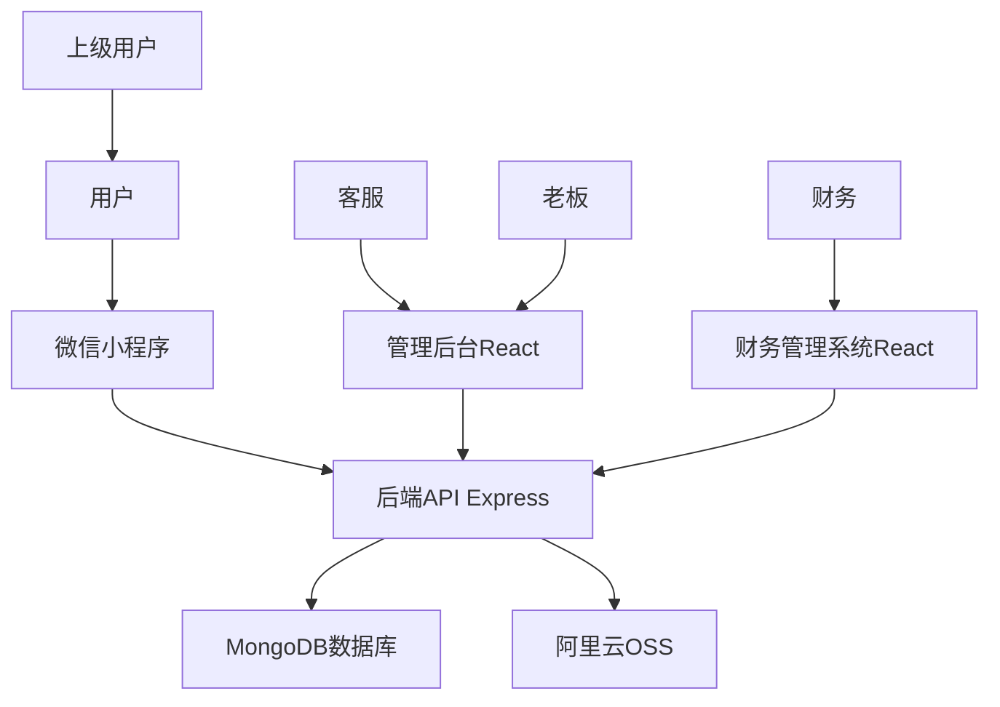

# 小红书审核网站系统架构设计

## 系统概述
这是一个用于小红书任务审核与分账的完整系统，采用分布式架构确保资金安全：

### 系统架构
- **前端：微信小程序**（用户使用）
- **A系统（业务中台）**：用户管理、任务提交、审核流程、上下级关系
- **B系统（财务中台）**：资金账户、打款记录、收款方式管理

### 通信机制
A系统通过加密接口（API Key + 签名）与B系统通信，实现账号同步和订单推送，确保业务和资金的完全隔离。

支持用户提交任务截图，经过四级审核流程（提交→客服审核→老板确认→财务打款）后进行分账处理。系统包含用户层级关系，支持佣金自动分配。

## 核心角色与权限

1. **普通用户 (User)**: 小程序端用户，接单做任务，上传截图，查看进度，绑定收款账号，发展下级
2. **上级/代理 (Agent)**: 小程序端用户，除了做任务，还能查看下级团队数据和返佣
3. **带教老师 (Mentor)**: A系统后台，一审人员，负责查看图片是否合格，进行通过或驳回
4. **老板 (Boss/Admin)**: A系统后台，二审人员+超级管理员，负责确认客服通过的单子，管理任务单价，管理员工
5. **财务 (Finance)**: B系统后台，结算人员，只负责根据指令打款，无法查看任务图片

## 核心业务流程

### 1. 账号注册与同步流
1. 用户在微信小程序授权登录
2. A系统获取OpenID，创建用户记录（记录邀请人的parent_id）
3. A系统立即调用B系统接口，自动注册同名财务账号
4. B系统返回remote_uid，A系统保存完成绑定

### 2. 任务提交与审核流
1. **提交**: 用户选择任务类型 → 系统显示当前单价 → 用户上传截图 → 提交
   - *关键*: 系统记录**快照价格**，防止后续改价影响已提交订单
2. **一审**: 客服查看图片
   - *二维码*: 检查是否重复（MD5去重）
   - *评论*: 检查评论内容
   - *笔记*: 检查头像/编辑按钮防盗图
3. **二审**: 老板批量查看客服通过的单子，进行最终确认

### 3. 结算与打款流
1. **推送**: 老板确认后，A系统将订单数据推送给B系统
2. **待打款**: B系统生成待结算记录
3. **打款**: 财务进行转账（手动或对接支付接口）
4. **完成**: B系统回调，通知A系统更新状态

## 技术栈
- **微信小程序**: 原生微信小程序框架
- **管理后台前端**: React.js
- **后端**: Node.js + Express
- **数据库**: MongoDB
- **图片存储**: 阿里云OSS
- **认证**: JWT + 微信授权
- **财务系统**: 独立的React应用

## 系统架构图



## 数据库设计 (分离业务库和财务库)

### 业务库 (System A)

#### 用户表 (users)
```sql
{
  _id: ObjectId,
  openid: String,           -- 微信OpenID
  username: String,         -- 用户名
  role: String,             -- 'part_time', 'mentor', 'hr', 'manager', 'boss', 'finance'
  parent_id: ObjectId,      -- 上级用户ID
  remote_uid: String,       -- B系统用户ID
  invite_code: String,      -- 邀请码
  createdAt: Date
}
```

#### 任务配置表 (task_settings)
```sql
{
  _id: ObjectId,
  imageType: String,        -- 'qrcode', 'comment', 'note'
  snapshotPrice: Number,    -- 当前单价
  is_active: Boolean,       -- 是否启用
  updated_at: Date
}
```

#### 图片审核表 (image_reviews)
```sql
{
  _id: ObjectId,
  userId: ObjectId,         -- 用户ID
  imageUrl: String,         -- 图片地址
  imageType: String,        -- 任务类型: 'customer_resource', 'note', 'comment'
  image_md5: String,        -- 图片MD5 (防重复)
  snapshotPrice: Number,    -- 提交时的快照单价
  snapshotCommission1: Number, -- 一级佣金
  snapshotCommission2: Number, -- 二级佣金
  status: String,           -- 'pending'=待审核, 'mentor_approved'=带教老师通过, 'manager_rejected'=经理驳回, 'manager_approved'=经理通过, 'finance_processing'=财务处理, 'completed'=已完成, 'rejected'=已驳回
  mentorReview: {           -- 带教老师审核信息
    reviewer: ObjectId,     -- 审核人ID
    approved: Boolean,      -- 是否通过
    comment: String,        -- 审核意见
    reviewedAt: Date
  },
  managerApproval: {        -- 经理确认信息
    approved: Boolean,      -- 是否通过
    comment: String,        -- 确认意见
    approvedAt: Date
  },
  financeProcess: {         -- 财务处理信息
    amount: Number,         -- 打款金额
    commission: Number,     -- 佣金
    processedAt: Date
  },
  deviceInfo: {             -- 设备信息
    accountName: String,    -- 账号名称
    status: String,         -- 设备状态
    influence: [String]     -- 影响力标签
  },
  auditHistory: [{          -- 审核历史记录
    operator: ObjectId,     -- 操作人ID
    operatorName: String,   -- 操作人姓名
    action: String,         -- 操作类型
    comment: String,        -- 操作意见
    timestamp: Date
  }],
  createdAt: Date
}
```

#### 审核日志表 (audit_logs)
```sql
{
  _id: ObjectId,
  review_id: ObjectId,       -- 关联image_reviews表
  operator_id: ObjectId,
  action: String,           -- 'mentor_pass', 'mentor_reject', 'manager_approve', 'manager_reject', 'finance_process', 'reject'
  old_status: String,        -- 字符串状态
  new_status: String,        -- 字符串状态
  comment: String,
  createdAt: Date
}
```

### 财务库 (System B)

#### 用户账户表 (account_users)
```sql
{
  _id: ObjectId,
  real_name: String,        -- 真实姓名
  alipay_account: String,   -- 支付宝账号
  bank_name: String,        -- 银行名称
  bank_account: String,     -- 银行卡号
  balance: Number,          -- 账户余额
  createdAt: Date
}
```

#### 打款订单表 (payout_orders)
```sql
{
  _id: ObjectId,
  source_order_id: String,  -- A系统订单ID
  user_id: ObjectId,        -- B系统用户ID
  amount: Number,           -- 打款金额
  status: Number,           -- 0=待打款, 1=已打款
  operator_id: ObjectId,    -- 操作财务ID
  paid_at: Date,
  createdAt: Date
}
```

#### 资金流水表 (fund_logs)
```sql
{
  _id: ObjectId,
  order_id: ObjectId,
  user_id: ObjectId,
  amount: Number,
  type: String,             -- 'payout', 'commission'
  operator_id: ObjectId,
  createdAt: Date
}
```

## API设计

### 用户相关
- POST /api/auth/register - 用户注册
- POST /api/auth/login - 用户登录
- GET /api/users/profile - 获取用户信息

### 图片审核
- POST /api/images/upload - 上传图片
- GET /api/reviews - 获取审核列表（根据角色）
- PUT /api/reviews/:id/mentor-review - 带教老师审核
- PUT /api/reviews/:id/manager-approve - 经理确认
- PUT /api/reviews/:id/finance-process - 财务处理

## 安全与风控

### 接口安全
- **JWT认证**: 前后端身份验证
- **角色权限控制**: 基于角色的访问控制
- **API签名**: A系统与B系统间接口采用API Key + 签名机制
- **IP白名单**: B系统仅允许公司内网IP访问

### 业务风控
- **MD5去重**: 图片MD5校验，防止重复提交骗取奖励
- **快照价格**: 任务提交时记录单价快照，防止后续改价影响
- **幂等性设计**: 防止重复操作（如老板重复确认）
- **审核日志**: 完整记录所有审核操作，便于追溯

### 数据安全
- **数据库分离**: 业务数据和财务数据物理隔离
- **敏感信息加密**: 用户支付信息加密存储
- **操作日志**: 记录所有关键操作

## 部署考虑
- 前后端分离部署
- 数据库备份
- 图片CDN加速

## 扩展功能规划

### 待实现功能
1. **佣金分配规则**: 支持多级分销，设置各级返佣比例
2. **推广海报**: 生成带邀请码的二维码海报
3. **团队管理**: 上级用户查看下级团队数据和收益
4. **数据统计**: 各类型任务占比分析、用户活跃度统计
5. **消息推送**: 审核结果通知、佣金到账通知
6. **财务对接**: 支持支付宝批量转账、企业付款到零钱
7. **审核超时**: 长时间未审核的任务自动流转或提醒
8. **用户层级**: 支持无限级用户层级关系

### 技术优化
1. **性能优化**: 数据库索引优化、缓存机制
2. **监控告警**: 系统监控、异常告警
3. **备份恢复**: 数据库自动备份、灾难恢复
4. **日志分析**: 用户行为分析、业务指标监控